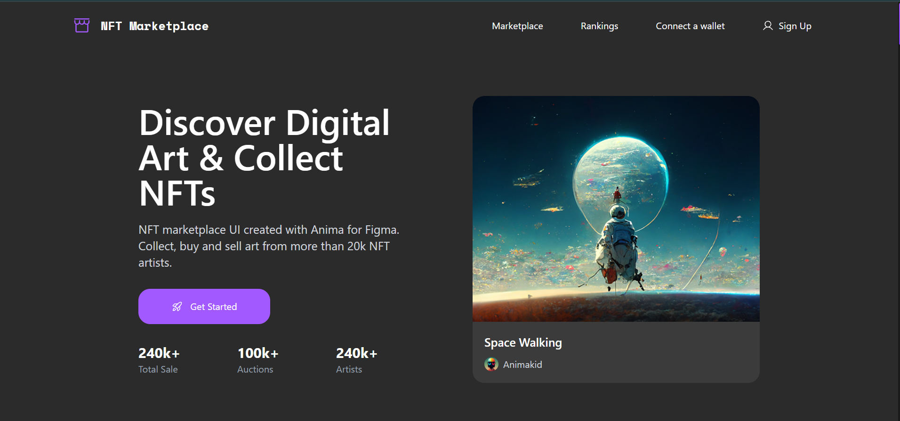
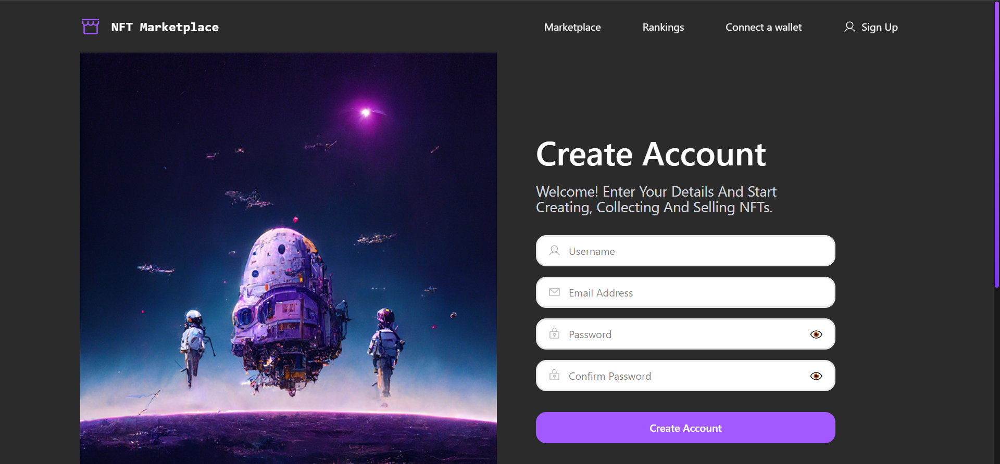

# NFT Marketplace

A responsive NFT marketplace website built with HTML, CSS, JavaScript, Tailwind CSS, and Vite.

## 🌐 Live Demo

**[🚀 View Live Demo](https://ehsan-elahi-dev.github.io/NFT-marketplace/)**

## 📸 Screenshots

### 🏠 Main Page

---

### 🔐 Sign Up Page

## ✨ Features

- Responsive NFT marketplace design
- Modern and clean user interface
- Dynamic NFT data rendering
- NFT collection cards
- Sign Up page
- Responsive navigation
- Mobile menu
- Interactive UI elements
- Fully responsive layout
- Desktop and mobile support

## 🛠️ Built With

- HTML5
- CSS3
- JavaScript
- Tailwind CSS
- Vite

## 📌 About

This project was built to practice creating a modern NFT marketplace interface with responsive design and interactive functionality.

It includes a responsive marketplace homepage, dynamic NFT content, navigation, mobile menu, and a dedicated Sign Up page.

## 👨‍💻 Author

**Ehsan Elahi**

**[GitHub](https://github.com/ehsan-elahi-dev)**
